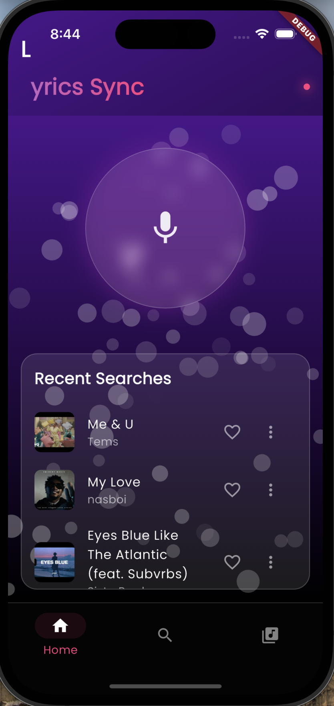
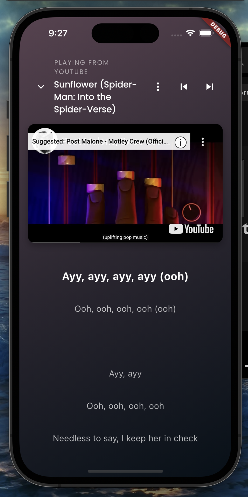
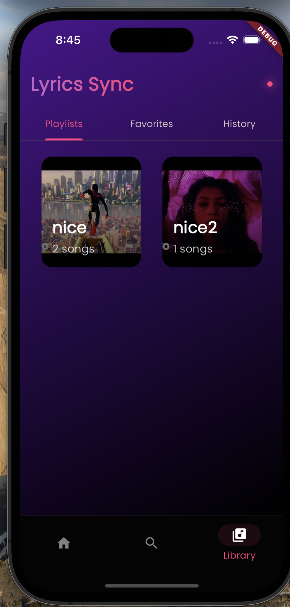
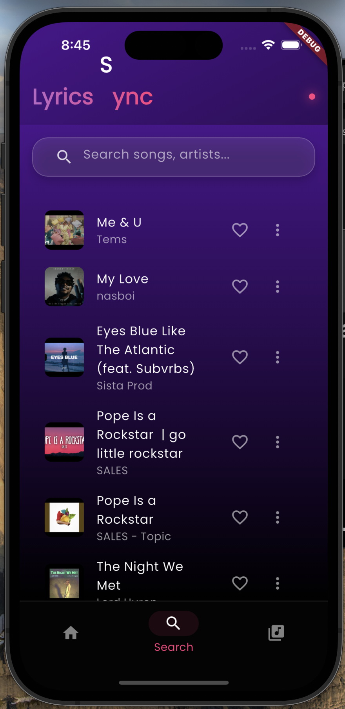
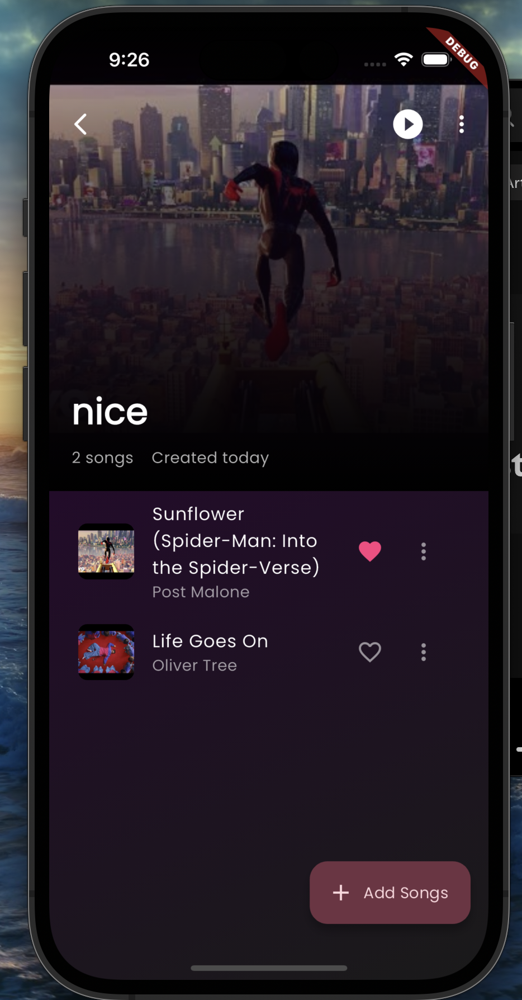
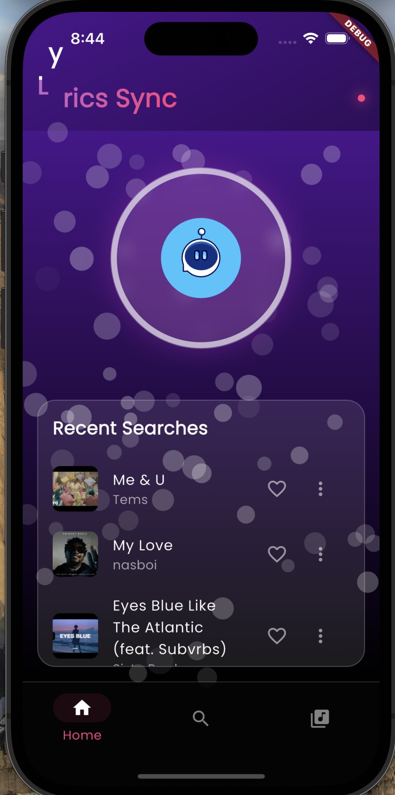

# Zimi - Music Recognition & Lyrics App

  

Zimi is a sophisticated music recognition and lyrics app that combines beautiful UI design with powerful features. Using ACRCloud for music recognition and providing synchronized lyrics with YouTube integration, it offers a complete music discovery experience.

## ✨ Features

### 🎵 Music Recognition
- **Instant Recognition**: Tap and identify any song playing around you
- **Beautiful Animation**: Engaging microphone animation during listening
- **Recent History**: Keep track of your music discoveries
- **Particle Effects**: Dynamic background particles for visual feedback

### 🎤 Lyrics Experience
- **Synchronized Lyrics**: Real-time lyrics synchronization with music
- **YouTube Integration**: Watch music videos while reading lyrics
- **Dynamic Gradients**: Beautiful color transitions during playback
- **Auto-scroll**: Automatic lyrics scrolling during playback
- **Playback Controls**: Full control over music playback

### 📚 Library Management
- **Smart Playlists**: Create and manage your music collections
- **Drag & Drop**: Reorder songs with intuitive gestures
- **Queue Management**: Add songs to play next or queue
- **Favorites**: Mark and collect your favorite songs
- **Share**: Share songs with friends easily

### 🎨 UI/UX Features
- **Glassmorphism**: Modern, translucent UI elements
- **Dynamic Themes**: Beautiful gradient backgrounds
- **Smooth Animations**: Fluid transitions and effects
- **Responsive Design**: Adapts to different screen sizes
- **Intuitive Navigation**: Easy-to-use bottom navigation

## 🛠 Technical Implementation

### Core Technologies
- **Flutter & Dart**: Cross-platform development
- **BLoC Pattern**: State management
- **Hive**: Local data persistence
- **ACRCloud**: Music recognition service
- **YouTube API**: Video playback integration

### Key Components
- **Song Recognition**: `ACRCloud` integration
- **Lyrics Sync**: Custom `SynchronizedLyrics` widget
- **Playlist Management**: `ReorderablePlaylist` implementation
- **State Management**: `SongBloc` for app-wide state
- **Data Storage**: `DatabaseService` with Hive

## 📱 Screenshots

  
  &nbsp;&nbsp;&nbsp;&nbsp;
  
  &nbsp;&nbsp;&nbsp;&nbsp;
  

  
  &nbsp;&nbsp;&nbsp;&nbsp;
  
  &nbsp;&nbsp;&nbsp;&nbsp;
  

## 🚀 Getting Started

### Prerequisites
- Flutter SDK
- ACRCloud API credentials
- Android Studio / VS Code

